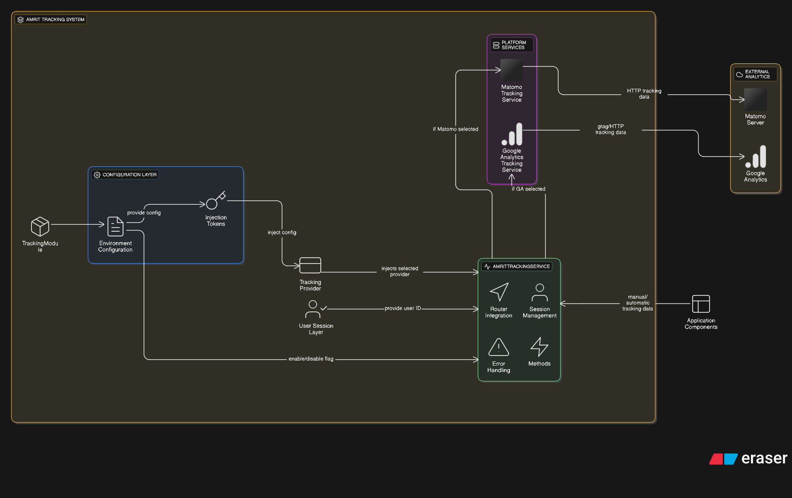

# Matomo Tracking System Documentation

## Table of Contents

1. [Overview](#overview)
2. [How It Works](#how-it-works)
3. [Setup and Configuration](#setup-and-configuration)
4. [Adding Tracking to Components](#adding-tracking-to-components)
5. [Adding a New Website to Matomo](#adding-a-new-website-to-matomo)
6. [API Reference](#api-reference)
7. [Best Practices](#tips-we-can-use-while-adding-tracking)
8. [Troubleshooting](#troubleshooting)

## Overview

The Amrit tracking system is a flexible analytics solution that supports multiple tracking providers (Matomo, Google Analytics) with a unified interface. It automatically tracks page views, user interactions, and custom events throughout your Angular application.

### Key Features

- Multiple provider support (Matomo, Google Analytics)
- Automatic page view tracking
- User identification tracking
- Environment-based configuration
- Built-in error handling and fallbacks
- Rich event tracking capabilities

## How It Works

### System Architecture Diagram



*High-level architecture showing the complete data flow from Angular components to external analytics platforms*

### Architecture Overview

The Amrit tracking system follows a layered architecture pattern:

#### 1. Configuration Layer
- **TrackingModule**: Provides dependency injection configuration
- **Environment Configuration**: Defines platform-specific settings (Matomo/GA)
- **Injection Tokens**: Enable flexible provider configuration

#### 2. Platform Services Layer
- **Matomo Tracking Service**: Handles Matomo-specific tracking implementation
- **Google Analytics Tracking Service**: Handles GA-specific tracking implementation
- **Provider Selection**: Dynamically selects the appropriate service based on configuration

#### 3. Amrit Tracking Interface Layer
- **Router Integration**: Automatic page view tracking via Angular Router events
- **Session Management**: User session and ID management
- **Error Handling**: Graceful fallback mechanisms
- **Method Abstraction**: Unified tracking methods (trackEvent, trackButtonClick, etc.)

#### 4. Application Components Layer
- **Manual/Automatic Tracking**: Components can trigger tracking events
- **User Session Layer**: Provides user ID for session tracking
- **Enabled/Disable Flag**: Conditional tracking based on environment settings

#### 5. External Analytics Layer
- **Matomo Server**: Receives HTTP tracking data via matomo.php endpoint
- **Google Analytics**: Receives tracking data via GA tracking endpoints

```
┌─────────────────────┐    ┌──────────────────────┐     ┌─────────────────────┐
│  Angular Component  │───▶│  AmritTrackingService │───▶│  TrackingProvider   │
└─────────────────────┘    └──────────────────────┘     │  (Matomo/GA)        │
                                      │                 └─────────────────────┘
                                      ▼                            │
                           ┌──────────────────────┐                ▼
                           │  Router Events       │    ┌─────────────────────┐
                           │  (Auto Page Tracking)│    │  External Analytics │
                           └──────────────────────┘    │  Platform           │
                                                       └─────────────────────┘
```

### Component Interaction Flow

1. **Initialization**: `AmritTrackingService` loads the appropriate tracking provider based on environment configuration
2. **Auto-tracking**: Router events are automatically captured for page view tracking
3. **Manual tracking**: Components can call tracking methods for custom events
4. **Provider delegation**: All tracking calls are forwarded to the configured provider (Matomo/GA)

## Setup and Configuration

### 1. Environment Configuration

Add tracking configuration to your environment files:

```typescript
// src/environments/environment.ts
export const environment = {
  // ... other config
  tracking: {
    platform: "matomo", // or 'ga'
    siteId: 1,
    trackerUrl: "https://matomo.piramalswasthya.org/",
    trackingPlatform: "platform",
    enabled: true,
  },
};
```

### 2. Module Import

Import the tracking module in your app module:

```typescript
// app.module.ts
import { TrackingModule } from "Common-UI/src/tracking";

@NgModule({
  imports: [
    // ... other imports
    TrackingModule.forRoot(),
  ],
  // ...
})
export class AppModule {}
```

## Adding Tracking to Components

### Basic Component Integration

Here's how to add tracking to any Angular component:

```typescript
import { Component } from "@angular/core";
import { AmritTrackingService } from "@common-ui/tracking";

@Component({
  selector: "app-user-registration",
  templateUrl: "./user-registration.component.html",
})
export class UserRegistrationComponent {
  constructor(private trackingService: AmritTrackingService) {}

  // Track button clicks
  onSubmitRegistration() {
    this.trackingService.trackButtonClick("Submit Registration");
    this.trackingService.trackFormSubmit("User Registration Form");
  }

  // Track field interactions
  trackFieldInteraction(fieldName: string) {
    this.trackingService.trackFieldInteraction(fieldName, "Facility Selection");
  }
}
```

### Template Integration

Add tracking to template interactions:

```html
<!-- user-registration.component.html -->
<form (ngSubmit)="onSubmitRegistration()">
  <input
    type="text"
    placeholder="Username"
    (focus)="trackFieldInteraction('username')"
  />

  <input
    type="email"
    placeholder="Email"
    (focus)="trackFieldInteraction('email')"
  />

  <button
    type="button"
    (click)="trackFieldInteraction('Show Password Requirements')"
  >
    Show Requirements
  </button>

  <button type="submit" (click)="trackFieldInteraction('Registration Form')">
    Register
  </button>
</form>
```

## Adding a New Website to Matomo

### Step 1: Access Matomo Admin Panel

1. Log into your Matomo instance admin panel
2. Navigate to **Administration** → **Websites** → **Manage**

### Step 2: Add New Website

1. Click **"Add a new website"**
2. Fill in the website details:
   ```
   Website Name: Your Website Name
   Website URL: https://yourwebsite.com
   Time zone: Select appropriate timezone
   Currency: Select currency if e-commerce tracking needed
   ```

### Step 3: Get Tracking Information

After creating the website, Matomo will provide:

- **Site ID**: A unique number (e.g., 3)
- **Tracking URL**: Your Matomo instance URL

### Step 4: Configure Your Application

Update your environment configuration:

```typescript
// src/environments/environment.prod.ts
export const environment = {
  tracking: {
    enabled: true,
    platform: "matomo",
    siteId: 3, // The new Site ID from Matomo
    trackerUrl: "https://matomo.piramalswasthya.org/",
  },
};
```

### Step 5: Verify Tracking

1. Deploy your application with the new configuration
2. Visit your website
3. Check Matomo dashboard for incoming data
4. Navigate to **Visitors** → **Real-time** to see live visitors


## API Reference

### AmritTrackingService Methods

| Method                    | Parameters                                                         | Description                      |
| ------------------------- | ------------------------------------------------------------------ | -------------------------------- |
| `trackEvent()`            | `category: string, action: string, label?: string, value?: number` | Track custom events              |
| `trackButtonClick()`      | `buttonName: string`                                               | Track button interactions        |
| `trackFormSubmit()`       | `formName: string`                                                 | Track form submissions           |
| `trackFeatureUsage()`     | `featureName: string`                                              | Track feature utilization        |
| `trackFieldInteraction()` | `fieldName: string, category?: string`                             | Track form field interactions    |
| `setUserId()`             | `userId: string \| number`                                         | Set user identifier for tracking |

### Event Categories

| Category       | Purpose                      | Example Actions                                    |
| -------------- | ---------------------------- | -------------------------------------------------- |
| `UI`           | User interface interactions  | `ButtonClick`, `MenuOpen`, `TabSwitch`             |
| `Form`         | Form-related activities      | `Submit`, `Validation Error`, `Field Focus`        |
| `Feature`      | Feature usage tracking       | `Usage`, `Enable`, `Configure`                     |
| `Registration` | User registration flow       | `Field Interaction`, `Step Complete`, `Validation` |
| `Navigation`   | Page and route changes       | `Page View`, `Route Change`, `Back Button`         |

### Tips we can use while adding tracking
- <b>Inputs:</b> Can use (focus) to call the tracking function so that it calls only once for the input.

- <b>Dropdowns (mat-select):</b> Can use (selectionChange) to call function to track events.

- <b>Buttons:</b> Can use (click) to call function to track events.
Use the field label plus 'Button' (e.g., 'Advance Search Button').

## Troubleshooting

### Common Issues

1. **Events not appearing in Matomo**

   ```typescript
   // Check if tracking is enabled
   console.log("Tracking enabled:", environment.tracking.enabled);

   // Verify site ID and URL
   console.log("Site ID:", environment.tracking.siteId);
   console.log("Tracker URL:", environment.tracking.trackerUrl);

   // Check browser console for errors
   ```

2. **Script loading failures**

   ```typescript
   // Check network connectivity to Matomo instance
   // Verify CORS settings on Matomo server
   // Check Content Security Policy (CSP) headers
   ```

3. **User ID not being set**

   ```typescript
   // Verify session storage service is working
   const userId = this.sessionStorage.getItem("userID");
   console.log("Retrieved User ID:", userId);

### Support

For additional support:

1. Check Matomo documentation: https://matomo.org/docs/
2. Review browser developer tools for errors
3. Test with Matomo's real-time visitor log
4. Verify network requests to tracking endpoint

---

_Last updated: September 2025_
